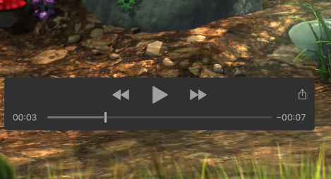

# Phase 1 Requirements

This is a checklist of acceptance requirements for a VLCJ/JavaFX based video player.

- [✔] Java version is Java 11
- [✔] Application must use standard Java build tools such as Maven or Gradle
- [✔] Application code will be Java (i.e. Not Scala, Kotlin, Groovy, Clojure, etc.)

## Target OS

- [✔] macOS (Catalina)
- [ ] Ubuntu 19.10

## Video Playback

The video player will be able to play the following (at a minimum)

- [ ] Play H.264 HD local file
- [ ] Play H.264 HD remote file via http
- [ ] Play HEVC 4K remote file via http
- [ ] Play HEVC HD remote file via http
- [ ] Play ProRes 422 HD local file
- [ ] Play VP9 4K remote file via http
- [ ] Play VP9 HD remote file via http

## Video UI Controls

We would prefer that the video controls mimic, as much as possible, those of the stock AVKit controls:



- [ ] By default the controls are hidden.
- [ ] The controls appear when a mouse is moved in the video window. 
- [ ] The controls disappear when the window loses focus, the mouse leaves the window or the video window is clicked outside of the control's grey box.

### Play/pause

- [ ] Play/pause button that toogles play/pause state of video playback
- [ ] Play icon is displayed when the video is paused/stopped
- [ ] Pause icon is displayed when video is playing or shuttling forward or shuttling reverse

### Video Scrubber

- [ ] Video scrubber/slider (This is the slider seen on every video player)
- [ ] Scrubber should display current position into video
- [ ] Moving slider seeks to correct position in video
- [ ] When an external seek command is received via UDP, the video will seek to that position and the slider will correctly reflect that position.

### Current Elapsed Time Label

- [ ] Current time label displaying the elapsed time into the video at second resolution in mm:ss format

### Total duration/remaining time label

- [ ] Total/remaining time label 
- [ ] By default, displays the total duration of the video in mm:ss format.
- [ ] When toggled by clicking on the label, will display the remaining duration of the video in mm:ss format
- [ ] Clicking the label toggles between total duration and remaining duration

### Open local file menu item

- [ ] When item to open local file

### Open remote URL menu item

- [ ] Menu item to open remote file (using a URL)

### Menu item to set UDP port

- [ ] Menu item to set a preference for the UDP remote communication port.
- [ ] Changing the port number restarts the process listening for remote UDP requests on the specified port
- [ ] Changing the port number saves the port to a local preference.
- [ ] On startup, this preference is read and the UDP process is started listening on this port.

### Menu item to set time-window for display of an individual bounding box.

- [ ] Menu item to set a preference for the a time-window (in seconds) to display a bounding box.
- [ ] Changing the time-window saves it to a local preference

## UDP Remote Control

__NOTE:__ MBARI provides a library for remote control of video players at [vcr4j-sharktopoda-client](https://github.com/mbari-media-management/vcr4j/tree/master/vcr4j-sharktopoda-client).

- [ ] Include [vcr4j-sharktopoda-client](https://github.com/mbari-media-management/vcr4j/tree/master/vcr4j-sharktopoda-client) (current version is _4.1.0_) in the Java build
- [ ] Implement the [ClientController](https://github.com/mbari-media-management/vcr4j/blob/master/vcr4j-sharktopoda-client/src/main/java/org/mbari/vcr4j/sharktopoda/client/ClientController.java) interface so that it can be used to control the video player.

Some things to note about our remote protocol when implementing the interface:

- Play accepts a rate. A rate of 1.0 is normal playback speed, 2.0 is twice playback, 0.0 is stopped, etc. Slow playback and fast playback are vital to our apps.
- The seek elapsed time does not need to be frame accurate, but do your best ;-) We do a great deal of small, fast seeks forwards and backwards to simulate scrolling through the video.
- We use frameAdvance quite a bit. Again, it does not need to be frame accurate. A best effort of calculating the time delta between frames and seeking forward by that time should be sufficient.
- Note the framecapture method ... this captures a frame from the video and writes it to disk at the specified location. I think JavaFX nodes have a snapshot method that may be sufficeint to grab an image from.

## Bounding Box Annotation

Our long-term goal is to allow scientists to view existing rectangular bounding boxes over video and create new bounding boxes. The information about these bounding boxes will be passed back and forth, as JSON, between external apps and the video player via UDP.

When the application is started it will fetch existing bounding boxes for the video from a remote app via UDP. We do not have the spec for this communication written yet. So it will not be included in phase 1, but please keep this in mind when creating the video player. You may want to create events such as DeleteEvent, UpdateEvent, CreateEvent that the UDP remote protocol will create and post to the EventBus. Each of the events will include a field of `associationUuid` to indicate which bounding box it's targeting. The video player should listen for these events on the EventBus and update the internal bounding box data as appropriate.

A _bounding box_ is a labeled and localized rectangular region at a particular moment (e.g. frame) in the video. At a minimum, each bounding box will consist of the following fields:

- `associationUuid` - The UUID primary key of the bounding box.
- `elapsedTimeMillis` - The index info the video as milliseconds since the start of the video
- `x` - The x location in image coordinates (origin of 0,0 is upper left corner of video) as pixels.
- `y` - The y location in image coordinates as pixels
- `width` - The width of the bounding box in pixels
- `height` - The height of the bounding box in pixels
- `concept` - A label (String) that provides an human readable id of the object that is localized. e.g. We often use species names like `Aegina citrea`.


- [ ] A bounding box should be drawn at the correct moment in the video (it does not have to be frame accurate, a best effort to the correct moment is likely sufficient)
- [ ] A bounding box should have it's label drawn (At some point we may want a toggle to display/hide the concept label)
- [ ] A bounding box should also be drawn from `elapsedTimeMillis - timewindow/ 2.0` to `elapsedTimeMillis + timewindow / 2.0` in a representation that is subdued compared to how it will be drawn at the correct frame.
- [ ] A bounding box will be scaled and translated from its source coordinates (pixels relative to full scale video) to the correct location on the scaled and translated video, as shown at <https://youtu.be/h1qmi8wMlJ8>
- [ ] Users will be able to create new bounding boxes by clicking and dragging on the video surface. The resulting bounding box will use the `elapsedTimeMillis` of the video when the initiating click occurs.
- [ ] Users will be able to create new bounding boxes when the video is playing, paused, or shuttling.
- [ ] The most recently created bounding box will be _selected_.
- [ ] Selected bounding boxes will be represented using a distinct color from other bounding boxes.
- [ ] External apps will be able to select bounding boxes (via are yet to be defined UDP protocal). These boxes should be displayed as _selected_.
- [ ] External apps will be able to delete bounding boxes (via UDP). These boxes should be removed from the internal data representation and should no longer drawn. 
- [ ] External apps will be able to change the concept field (via UDP) of bounding boxes.
- [ ] When a new bounding box is draw a NewBoundingBox event is posted to the EventBus containing the new BoundingBox (you can use a random UUID, the default concept is `object`).

For phase 1, we suggest using an event bus such as the one below to handle events such as the creationg a new bounding box, deleting bounding boxes, changing bounding box concepts, and bounding box selection events. This would allow for easier maintenance and inclusion of other hooks down the road. The internal data representations should listen for events on this EventBus and add, delete, select, update as appropriate.

The intended workflow for new bounding boxes is:

1. A user interactively draws a bounding box on the video
2. A NewBoundingBox event is posted to the EventBus. 
3. The bounding box is added to the internal data.
4. In a later phase, we will add a listener to the event bus that forwards the new bounding box to an external app
5. Users will be able to update the concept in the external app
6. That external change is forwarded back to the video player and the corresponding bounding box has it's concept updated so that it's label is drawn correctly on the video.


```java

import io.reactivex.Observable;
import io.reactivex.subjects.PublishSubject;
import io.reactivex.subjects.Subject;

/**
 * Requires https://github.com/ReactiveX/RxJava/tree/2.x
 */
public class EventBus {

    private final Subject<Object> rxSubject = PublishSubject.create().toSerialized();

    public void send(Object o) {
        if (o != null) {
            rxSubject.onNext(o);
        }
    }

    public Observable<Object> toObserverable() {
        return rxSubject;
    }
}
```
